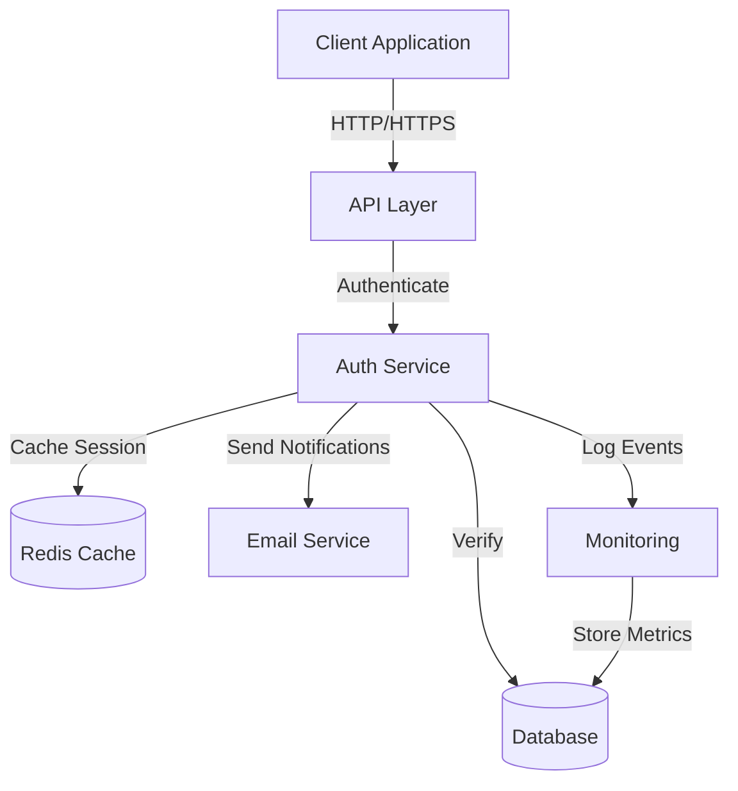
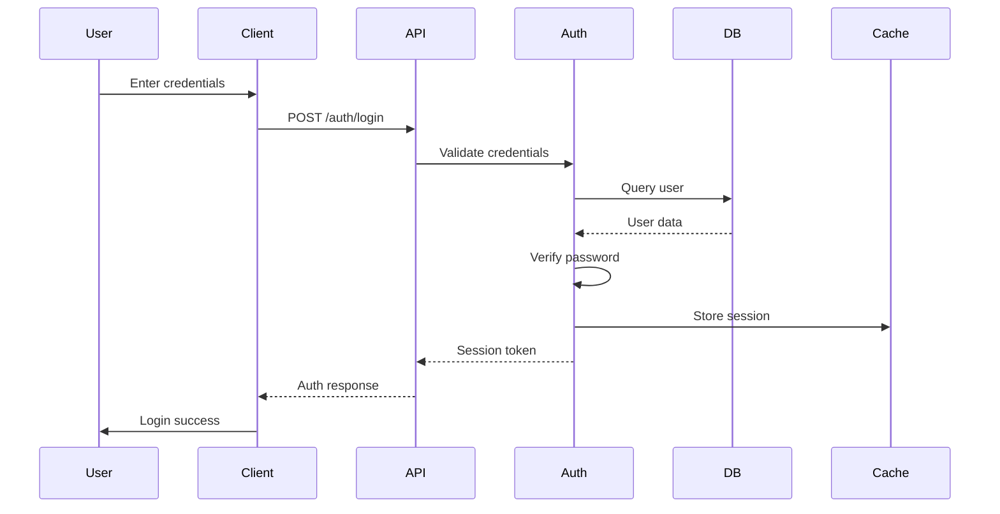
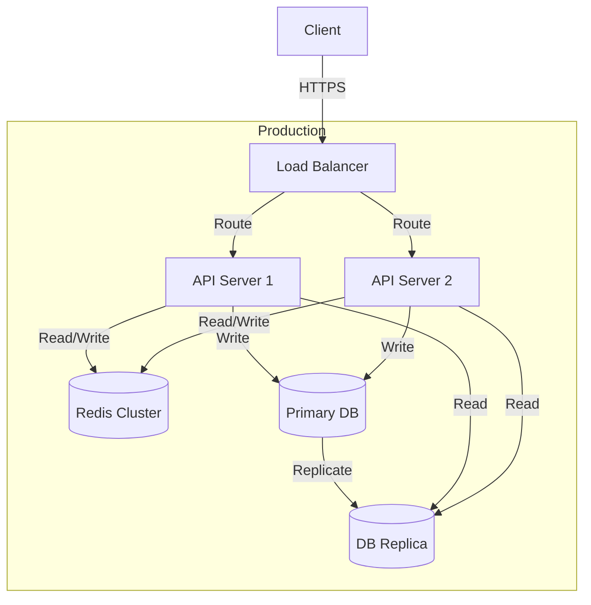

# Authentication System Architecture

## System Overview



## Component Architecture

### Core Components

1. **API Layer**
   - Request handling
   - Rate limiting
   - CORS
   - Security headers

2. **Auth Service**
   - User authentication
   - Session management
   - Password policies
   - 2FA handling

3. **Database**
   - User records
   - Session data
   - Security logs
   - Audit trails

4. **Cache Layer**
   - Session storage
   - Rate limit tracking
   - Temporary tokens

5. **Monitoring**
   - Authentication metrics
   - Security alerts
   - Performance tracking
   - Error logging

## Authentication Flow



## Security Architecture

```mermaid
graph LR
    subgraph Security_Layer
        Headers[Security Headers]
        CORS[CORS Policy]
        Rate[Rate Limiting]
        WAF[Web Application Firewall]
    end

    subgraph Auth_Layer
        JWT[JWT Handler]
        Password[Password Policy]
        TwoFactor[2FA Service]
        Session[Session Manager]
    end

    subgraph Data_Layer
        Encryption[Data Encryption]
        Policies[Security Policies]
        Audit[Audit Logging]
        Backup[Backup Service]
    end

    Security_Layer -->|Protect| Auth_Layer
    Auth_Layer -->|Secure| Data_Layer
```



## Integration Points

### External Services

1. **Email Provider**
   - Verification emails
   - Password reset
   - Security notifications

2. **OAuth Providers**
   - Social login
   - Identity federation
   - Token exchange

3. **Monitoring Services**
   - Error tracking
   - Performance monitoring
   - Security alerts

## Deployment Architecture



## Configuration Management

### Environment Variables

```yaml
AUTH_SERVICE:
  JWT_SECRET: "***"
  SESSION_DURATION: 86400
  REFRESH_TOKEN_DURATION: 2592000
  PASSWORD_HASH_ROUNDS: 12

SECURITY:
  CORS_ORIGINS: ["https://app.example.com"]
  RATE_LIMIT_MAX: 100
  RATE_LIMIT_WINDOW_MS: 900000

DATABASE:
  URL: "postgresql://..."
  POOL_SIZE: 20
  SSL_MODE: "require"

CACHE:
  URL: "redis://..."
  TTL: 3600

MONITORING:
  ERROR_THRESHOLD: 10
  ALERT_WEBHOOK: "https://..."
```

## Performance Considerations

1. **Connection Pooling**
   - Database connection management
   - Cache connection pooling
   - Request queuing

2. **Caching Strategy**
   - Session data caching
   - User profile caching
   - Token blacklist caching

3. **High Availability**
   - Database replication
   - Cache clustering
   - API load balancing 